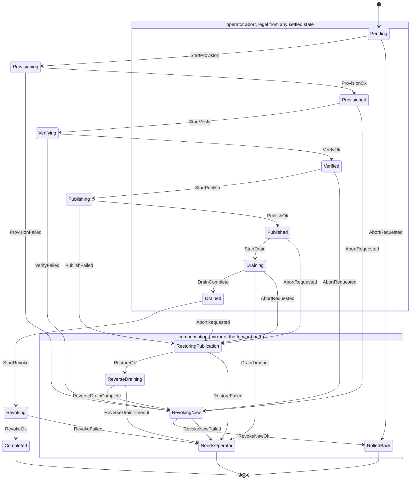

# KAWACH — Design & Security Architecture

**KAWACH** — *Key And Wallet Audit & Credential Hardening*
(*कवच* — Sanskrit: armour, a protective shell.)

| | |
|---|---|
| **Document status** | Draft 0.1 — Stage 1 (design + core traits + rotation state machine) |
| **Audience** | Platform-security engineers evaluating KAWACH for production use |
| **Scope of this doc** | Threat model, security invariants and their *enforcement mechanisms*, the rotation state machine and its safety proof obligations, the audit-log construction, and an explicit statement of limitations |

> **Reading guide.** §3 (threat model) and §4 (invariants) define what KAWACH is *for*. §6 (rotation state machine) is where the engineering risk lives. §12 (limitations) is deliberately long — if you only read two sections, read §4 and §12.

---

## Table of contents

1. [Purpose and non-purpose](#1-purpose-and-non-purpose)
2. [Design principles](#2-design-principles)
3. [Threat model](#3-threat-model)
4. [Security invariants and how each is enforced](#4-security-invariants-and-how-each-is-enforced)
5. [Architecture](#5-architecture)
6. [The rotation state machine](#6-the-rotation-state-machine)
7. [Tamper-evident audit log](#7-tamper-evident-audit-log)
8. [Discovery](#8-discovery)
9. [Risk model](#9-risk-model)
10. [Configuration and the scope model](#10-configuration-and-the-scope-model)
11. [Least privilege](#11-least-privilege)
12. [Limitations, residual risk, and what could go wrong](#12-limitations-residual-risk-and-what-could-go-wrong)
13. [Dependency budget](#13-dependency-budget)
14. [Appendix A — threat/control matrix](#appendix-a--threatcontrol-matrix)
15. [Appendix B — glossary](#appendix-b--glossary)

---

## 1. Purpose and non-purpose

### 1.1 What KAWACH is

KAWACH is a self-hostable, operator-run tool that answers three questions for an
infrastructure estate:

1. **DISCOVERY** — *Where do credentials actually live?* Not where policy says they
   live: where they are, including the ones hardcoded in a Helm chart in 2021 by
   someone who has since left.
2. **AUDIT** — *For each credential, how bad is the current posture?* Age since
   rotation, plaintext-at-rest exposure, breadth of access, usage from unexpected
   locations, orphaned material. Expressed as a score with a **legible rationale**,
   not an oracle number.
3. **ROTATION** — *Change the credential without breaking production.* A two-phase
   commit (provision → verify → publish → drain → revoke) with a persisted state
   machine, automatic compensation on failure, and an explicit refusal to
   auto-resolve situations where any automatic action could cause an outage.

KAWACH is an **operator-side control-plane tool**. It runs when an operator or a
scheduler runs it. It is not in the request path of any application.

### 1.2 What KAWACH is explicitly not

This list is load-bearing. Products that blur these lines are how outages happen.

| KAWACH is **not** | Because |
|---|---|
| A secrets **store** | It stores metadata about secrets. It never stores a secret value. Your store is Vault / AWS Secrets Manager / etc. |
| A secrets **broker or proxy** | Applications never fetch credentials *through* KAWACH. It is never on the availability path of your workloads. |
| A **runtime** exfiltration detector | It has no agent, no eBPF, no syscall interception. It reasons over what backends and repositories tell it. |
| A **compliance certificate** | It produces evidence. It does not produce assurance. A clean KAWACH report is not proof of a clean estate — see [§8.4](#84-honesty-about-detection-quality). |
| A defence against **host root** | If an adversary is root on the KAWACH host while a rotation is in flight, they can read plaintext from process memory. Zeroization narrows the window; it does not close it. |
| A **key management system** | It does not generate, escrow, or manage long-lived cryptographic keys for applications. |

### 1.3 Deployment shape

```
operator ──> kawach CLI ──┬──> HashiCorp Vault      (backend-native auth: AppRole/token)
                          ├──> AWS Secrets Manager  (backend-native auth: IAM role)
                          ├──> filesystem / git     (read-only discovery)
                          └──> PostgreSQL, API vendors (rotation providers)
                                    │
                          local state (metadata + hash-chained audit log)
```

KAWACH holds **no ambient authority of its own**. It borrows the operator's or the
workload identity's authority from the backend's own auth system ([I4](#i4--no-master-credential-custody)).

---

## 2. Design principles

**P1 — Make the dangerous thing impossible to express, not merely discouraged.**
Where a security property can be moved into the type system, it is. A `SecretString`
has no `Serialize` impl, so serialising a struct containing one is a *compile error*,
not a runtime redaction that someone forgets. A `CommitToken` cannot be constructed
outside a confirmed, audited `--apply` run, so a provider *cannot* mutate the world
during a dry run even if its author wanted it to.

**P2 — Prefer a refusal to a guess.**
Every state in the rotation machine where automatic action could plausibly cause an
outage terminates in `NeedsOperator` with a full explanation, not a retry loop. An
operator paged at 3am is a much better outcome than a silently dropped connection
pool.

**P3 — Safety over completeness.**
If KAWACH cannot prove the new credential works, the old credential is not revoked.
Ever. The failure mode is "two valid credentials and an alert", never "zero valid
credentials".

**P4 — Every effect is preceded by a durable intent.**
Write-ahead journalling. If we crash between "intend to provision" and "provisioned",
we know the outcome is *unknown* and we reconcile against observed world state — we
never assume.

**P5 — Evidence over assertion.**
The audit log is hash-chained and externally anchored so that its integrity is
*checkable* by a third party, not asserted by us. The risk score decomposes into named
factors with cited evidence. "Trust me" is not a security control.

**P6 — A dependency is an attack surface.**
Every third-party crate is a supply-chain foothold with the same privileges as our
process. See the dependency budget in [§13](#13-dependency-budget). We hand-roll
small, well-tested things (glob matching) rather than import large ones.

**P7 — Document what is aspirational.**
Anything not enforced in code is labelled *NOT YET ENFORCED* in this document. We do
not claim security properties we do not implement. See [§12.4](#124-not-yet-enforced).

---

## 3. Threat model

### 3.1 Assets

| ID | Asset | Impact if compromised |
|---|---|---|
| **AS1** | Plaintext credential values, transiently in KAWACH memory during rotation | Direct compromise of the protected system |
| **AS2** | KAWACH's own backend credentials (Vault token, AWS role session) | Lateral access to *every* in-scope secret |
| **AS3** | The findings database (locations, fingerprints, risk scores) | A map of the estate's weak points — a targeting aid |
| **AS4** | The audit log | Loss of forensic truth; an insider erases their tracks |
| **AS5** | The fingerprint HMAC key | Enables offline dictionary attack against fingerprints of *low-entropy* secrets |
| **AS6** | Availability of the credentials KAWACH rotates | A botched rotation is a self-inflicted outage — treat as a first-class asset |

Note **AS6**. A rotation tool's most likely real-world harm is not a leak; it is an
outage it caused itself. The state machine in [§6](#6-the-rotation-state-machine) is
designed primarily around AS6.

### 3.2 Adversaries

| ID | Adversary | Assumed capability | Primary target |
|---|---|---|---|
| **A1** | **Artefact reader** — anyone who can read the repo, config, state directory, backups, CI logs, a screenshotted terminal, a pasted stack trace | Read any file KAWACH writes; read any byte KAWACH prints | AS1, AS3 |
| **A2** | **Host-local process** — a co-resident process, same or different UID; also core dumps, swap, `/proc`, crash reporters | Read files at its own privilege; read core dumps; potentially `ptrace` at same UID | AS1, AS5 |
| **A3** | **Malicious operator (insider)** — legitimate CLI access, wants to exfiltrate a secret or erase evidence | Full local privileges on the KAWACH host, including the state directory | AS1, AS4 |
| **A4** | **Network adversary** — MITM between KAWACH and Vault/AWS/PostgreSQL | Intercept, modify, replay traffic; attempt TLS downgrade | AS1, AS2 |
| **A5** | **Malicious plugin** — a third-party `SecretBackend` / `RotationProvider` implementation compiled into the binary | Arbitrary code execution *inside* the KAWACH process | AS1, AS2 |
| **A6** | **Prior thief** — already holds a stolen credential; the question is how long it stays valid and whether use is detected | Uses a valid credential from an unexpected location | AS6, blast radius |

### 3.3 Trust boundaries

```
┌────────────────────────────────────────────────────────────────────┐
│  KAWACH host                          ← A2, A3 operate here        │
│  ┌──────────────────────────────────────────────────────────────┐  │
│  │  kawach process                                              │  │
│  │  ┌─────────────┐  plaintext lives ONLY here, only in         │  │
│  │  │ SecretString│  zeroizing buffers, only during a rotation  │  │
│  │  └─────────────┘                            ← A5 operates here│  │
│  └──────────────────────────────────────────────────────────────┘  │
│  ┌──────────────┐  ┌──────────────┐  metadata + audit log only     │
│  │ state dir    │  │ audit log    │              ← A1, A3          │
│  └──────────────┘  └──────────────┘                                │
└────────────────────────────────────────────────────────────────────┘
        │ mTLS / TLS 1.2+                            ← A4
        ▼
┌──────────────┐ ┌──────────────┐ ┌──────────────┐
│ Vault        │ │ AWS Secrets  │ │ PostgreSQL   │
│ (own authN)  │ │ Mgr (IAM)    │ │ (rotation)   │
└──────────────┘ └──────────────┘ └──────────────┘
```

**The critical boundary is the process boundary.** Everything that crosses it —
files, logs, stdout, telemetry, error strings, network payloads to non-owning systems
— is assumed readable by A1. Therefore: nothing crossing it may contain AS1.

### 3.4 Explicitly out of scope

KAWACH does **not** defend against:

- **Kernel or root compromise of the KAWACH host.** Root can read `/proc/pid/mem`
  mid-rotation. Mitigations ([I2](#i2--zeroization-and-memory-hygiene)) narrow the
  window from "forever" to "the duration of one rotation step", which is a real
  improvement and not a defence.
- **A compromised Vault or AWS control plane** returning attacker-chosen data over a
  validly authenticated channel. KAWACH trusts its backends' *integrity* by
  construction; it verifies their *identity* (TLS) but cannot verify their honesty.
- **Malicious plugins (A5).** A `RotationProvider` compiled into the binary runs with
  full process privilege and legitimately receives plaintext. There is no in-process
  sandbox. Treat provider code as trusted, review it as such. Out-of-process,
  capability-restricted plugins are future work ([§12.5](#125-roadmap-not-commitments)).
- **Secrets that leaked before KAWACH was installed.** It will help you find and
  rotate them. It cannot un-leak them.
- **Side channels** — timing, cache, EM. Constant-time comparison is used for secret
  equality; nothing beyond that is claimed.
- **Compromise of the operator's workstation or their Vault credentials.** A3 with
  valid Vault authority can read secrets from Vault directly, without KAWACH. KAWACH's
  job there is limited to making the *attempt* evident in the audit log
  ([I5](#i5--tamper-evident-audit-log)).

---

## 4. Security invariants and how each is enforced

Each invariant states: **the property**, the **enforcement mechanism** (and whether it
is *type-level*, *runtime*, or *process*), the **test** that would fail if it
regressed, and the **residual risk** that remains even when the mechanism works.

Type-level enforcement is preferred because it fails at compile time in CI, on the
contributor's machine, before review — rather than at 3am in production.

---

### I1 — No plaintext secret leaves the process

> No secret value is ever written to disk, a log, telemetry, an error message, a
> serialised structure, or a crash dump.

**Enforcement — type-level (primary):**

`SecretString` deliberately implements **no `Serialize`** and **no `Display`**.

- Any attempt to `serde_json::to_string` a struct containing one is a **compile
  error**. There is no runtime redaction to forget, and no "someone added
  `#[derive(Serialize)]` to the struct six months later" failure mode — that
  derive will not compile. The author must consciously write `#[serde(skip)]`,
  which is a reviewable diff.
- Any `format!("{}", secret)` is a **compile error** — `Display` does not exist. This
  forces every intentional exposure through the greppable `expose()` API below.
- `Debug` **is** implemented, and prints exactly `SecretString([REDACTED])` — no
  length, no prefix, no hash. `Debug` must exist because `#[derive(Debug)]` on
  containing types is ubiquitous and we want that derive to be *safe by default*
  rather than absent. We deliberately do not leak length: length is a real, if small,
  constraint on a brute-force search.

**Enforcement — process (secondary):** exposure is a *finite, reviewable set of call
sites*. Plaintext is only reachable via `SecretString::expose(|bytes| …)`, a
closure-scoped accessor. Therefore `rg 'expose\(' ` enumerates the complete plaintext
attack surface of the codebase, and CI holds an allowlist of permitted exposure sites
(`ci/exposure-sites.allow`); a new one fails the build until a human adds it. This
converts "review everything" into "review the diff to one small file".

**Enforcement — runtime (defence in depth), *NOT YET IMPLEMENTED*:** a **redaction
tripwire**. In test builds, a `tracing` layer plus stdout/stderr interception hold a
registry of canary values used by the test fixtures and **panic the test process** if
any canary appears in any emitted byte. The whole integration suite would then run
under this tripwire, so a leak in any code path fails the build, including paths nobody
wrote a targeted test for. Designed, not built — see [§12.4](#124-not-yet-enforced).

**Enforcement — process hardening:** at startup on Unix, `RLIMIT_CORE` is set to 0 and
`PR_SET_DUMPABLE` to 0, so a crash cannot produce a core file containing AS1, and a
same-UID process cannot `ptrace` us. On Windows these have no equivalent and KAWACH
emits a startup warning — see [§12.2](#122-platform-asymmetry).

**Tests:** `crates/kawach-core/tests/type_level_guarantees.rs` asserts the *absence* of
`Serialize` and `Display` on `SecretString` (and of `Serialize` on `NewCredential` and
`CommitToken`) **at compile time**.

The mechanism is worth a note, because "assert this does not compile" is usually done
with `trybuild`, which compares compiler *stderr* text and therefore breaks on Rust
upgrades for reasons unrelated to the property. Instead we exploit inherent-impl
precedence: for a concrete type, `Probe::<T>::SERIALIZE` resolves to an inherent
associated const (`true`) when `T: Serialize` holds, and falls back to a blanket
trait default (`false`) when it does not. That yields a `const bool` usable in a
`const` assertion — deterministic, toolchain-independent, and evaluated by the
compiler. The same file carries **positive controls** (`Fingerprint` and `SecretRef`
*are* `Serialize`), so a probe that silently degraded to always answering "not
implemented" — which would make every negative assertion vacuous — fails the build.

Runtime tests cover the rest: `Debug` output of a secret and of a struct containing
one, error rendering, and full serialisation of a `Finding` derived from a canary
value.

**Residual risk:** A provider author can copy bytes out of the `expose` closure into a
`String` and log it. The closure makes this *visible in review*, not impossible. The
tripwire catches it in tests only if a test exercises that path.

---

### I2 — Zeroization and memory hygiene

> Secret material is overwritten in memory as soon as it is no longer needed, and
> never sits in a plain `String`.

**Enforcement — type-level:** `SecretString` wraps `Zeroizing<Vec<u8>>`; `Drop`
overwrites with a volatile write that the optimiser may not elide (`zeroize` crate).
The inner buffer is never handed out by value.

**Enforcement — design:** ingest paths avoid intermediate `String` allocations where
we control the parser. Where we do **not** control it — `serde_json` parsing a Vault
HTTP response allocates buffers we did not choose — we do the one thing we actually
can: we own the raw HTTP body buffer, and we **zeroize the response buffer after
parsing**. This is documented honestly rather than papered over; see residual risk.

**Enforcement — runtime, best effort:** `mlockall(MCL_CURRENT|MCL_FUTURE)` is attempted
at startup where permitted, to keep secret pages out of swap. Failure is a warning,
not an error, because it requires `RLIMIT_MEMLOCK` headroom that many containers lack.

**Tests:** a unit test that constructs a secret in a heap buffer, records the pointer,
drops it, and asserts the region no longer contains the plaintext (with the standard
caveat that this test proves the `Drop` ran, not that no copy survives elsewhere).

**Residual risk — stated plainly:** Rust moves are `memcpy`s. A `SecretString` moved
between stack frames may leave a stale copy in the abandoned frame that `Drop` never
sees, because `Drop` only knows about the final location. LLVM may spill secret bytes
to stack slots or registers we cannot reach. Zeroization in a non-GC language is a
*best-effort narrowing of the exposure window*, and anyone who tells you otherwise is
selling something. Against A2-with-a-core-dump it is effective; against A2-with-`ptrace`
during an active rotation it is not.

---

### I3 — Metadata only; findings never contain secret values

> The persisted database records *where* a secret is, never *what* it is.

**Enforcement — type-level:** `SecretRecord` and `Finding` have no field capable of
holding a value. `Finding` carries a `Fingerprint`, which is a
**128-bit truncated HMAC-SHA-256** under an installation-scoped key:

```
fingerprint = truncate_128( HMAC-SHA256(K_install, "kawach/fp/v1" || value) )
```

The value is consumed by the fingerprinting function and dropped; there is no code
path storing it.

**Design decision — no prefixes.** Many scanners store the first four characters of a
detected secret "for identification". KAWACH stores **zero** plaintext characters.
Four characters of an AWS key is a meaningful search-space reduction and a gift to A1
who steals the findings database. The cost is that a human cannot eyeball-match a
finding to a secret; we consider that the correct trade.

**Why HMAC and not a bare hash:** a bare SHA-256 of a low-entropy secret
(`postgres`, `changeme123`) is trivially reversible by dictionary. The install-scoped
key `K_install` means an adversary needs **both** AS3 (findings DB) and AS5 (the key,
stored `0600`, separately) to attempt a dictionary attack. Correlation across
installations is deliberately impossible — it is not a feature we need, and its
absence limits the damage of a leaked findings DB.

**Tests:** the redaction tripwire applied to the persisted database file; a test that
round-trips a canary through discovery and asserts the canary appears nowhere in the
serialised findings.

**Residual risk:** an adversary holding *both* the findings DB and the fingerprint key
can dictionary-attack fingerprints of low-entropy secrets. Argon2id instead of HMAC
would raise that cost, at a per-scan performance price; see
[§12.5](#125-roadmap-not-commitments).

---

### I4 — No master-credential custody

> KAWACH never asks a human to paste a privileged credential into it, and its
> configuration format cannot express one.

**Enforcement — type-level, via the schema:** the config's `auth` stanza is a Rust enum
whose variants contain **only** indirections — a file path, an environment variable
*name*, or a "use the ambient provider chain" marker. There is no `token: String`
field. A YAML file containing an inline token **fails to deserialise**, with an error
naming the offending key. You cannot misconfigure this into insecurity, because the
insecure configuration is not representable.

```yaml
# Representable:
auth: { method: approle, role_id_file: /run/secrets/role_id, secret_id_file: /run/secrets/secret_id }
auth: { method: token,   token_env: VAULT_TOKEN }          # name, not value
auth: { method: aws_default_chain }                        # IMDS / IRSA / SSO

# NOT representable — deserialisation error:
auth: { method: token,   token: "hvs.CAESIF…" }            # unknown field `token`
```

**Enforcement — runtime:** a config linter runs a Shannon-entropy check over every
string scalar in the loaded config and **refuses to start** if a high-entropy literal
appears — dogfooding our own discovery engine against ourselves.

**Residual risk:** a user can still point `token_env` at a variable they populated
badly, or `role_id_file` at a world-readable path. We check file modes on referenced
paths and warn; we do not control the user's provisioning pipeline.

---

### I5 — Tamper-evident audit log

> Every credential access and every rotation step is recorded in an append-only,
> hash-chained log whose modification is detectable.

Full construction in [§7](#7-tamper-evident-audit-log). Summary of the enforcement:

**Enforcement — cryptographic:** each entry commits to the previous entry's hash over a
*canonical binary encoding* (never over JSON text — see [§7.2](#72-canonical-encoding)).
Editing or reordering any historical entry invalidates every subsequent hash.

**Enforcement — type-level, the interesting part:** reading a secret *value* is the
single most dangerous operation in the system, so it is **impossible to perform without
an audit record existing first**. `SecretBackend::read` requires a `&ReadWitness`, and
a `ReadWitness` can only be minted by the audit log, by writing and `fsync`ing an
access-intent entry. There is no code path that reads a value without a durable audit
record already on disk. The witness's `Drop` writes an `outcome: abandoned` record if
the caller never completes it, so a panic mid-read is itself evidence.

Identically, `CommitToken` (required for every mutating call) can only be minted in
`--apply` mode *and* writes an audit record as a side effect of minting. Dry-run
literally cannot mutate: the token does not exist.

**Enforcement — external anchoring:** a hash chain alone does **not** detect
*truncation* of the tail — A3 can delete the last N entries and the remaining chain
verifies perfectly. This is the classic weakness and we address it directly: periodic
`Checkpoint` entries carry the head hash and sequence number, are optionally signed
with Ed25519, and are **anchored to an external system** (a Vault path or an S3
Object-Lock bucket) whose ACL denies KAWACH's own delete permission. Truncation past
the last anchor is then detectable by comparison, and requires the adversary to
compromise a *second* system with *different* credentials.

**Tests:** the witness lifecycle is unit-tested end to end — that no witness is issued
when the audit write fails (so an unwritable log denies the read), that `Drop` emits an
abandonment record, and that it still does so when the read **panics** mid-flight.
"Cannot read without a witness" needs no test: it is the function signature.

Chain verification is tested adversarially in
`crates/kawach-audit/tests/tamper_detection.rs`, which performs each of the six attacks
in §7.3 against a real log file — including asserting the two **negative** results, that
a bare chain does *not* detect tail truncation or a wholesale rewrite, before showing
that anchors and signatures do. `capability_enforcement.rs` closes the loop by running
the tokens above against a real chain rather than a test double.

**Residual risk:** A3 with local root can delete the entire log file. Tamper-*evident*
is not tamper-*proof*; the guarantee is "you will know", conditional on the anchor
being intact. Real-time shipping to a remote sink is the correct complement and is
[not yet implemented](#124-not-yet-enforced).

---

### I6 — Least privilege, verified

> KAWACH documents the minimum permissions it needs and refuses to run with
> detectably excessive ones.

**Enforcement — documentation:** exact Vault policy HCL and AWS IAM JSON in
[§11](#11-least-privilege). Minimum, not convenient.

**Enforcement — runtime:** `kawach doctor` performs a **privilege self-audit** and
exits non-zero on excess:

- *Vault*: `auth/token/lookup-self` reveals the token's policies. The presence of the
  `root` policy is a **hard refusal** — KAWACH will not operate as root, ever.
  `sys/capabilities-self` is then queried for each in-scope path, and any capability
  beyond what the configured operation requires (e.g. `delete` when no destructive
  operation is configured, or a `*` path glob) produces a finding.
- *AWS*: `sts:GetCallerIdentity` plus, where permitted,
  `iam:SimulatePrincipalPolicy` against a set of canary actions KAWACH should *not*
  be able to perform (`secretsmanager:DeleteSecret` on out-of-scope ARNs,
  `iam:CreateUser`). A principal that can perform them is reported.

The asymmetry is honest: Vault's introspection API makes this genuinely enforceable;
AWS's makes it partially so, since `SimulatePrincipalPolicy` is itself a permission we
would rather not require. Where we cannot verify, we say so in the report rather than
printing a green check.

**Residual risk:** a permission boundary or SCP can make a principal *appear* more
privileged than it effectively is, producing false findings; conversely,
resource-based policies elsewhere can grant access we never observe.

---

### I7 — Dry-run is the default; revocation follows verification

> No mutating operation occurs without an explicit `--apply`, and no old credential is
> revoked before the new one is proven to work.

**Enforcement — type-level (dry-run):** every mutating trait method takes
`&CommitToken`. `CommitToken`'s constructor is private to `kawach-core` and reachable
only through `ExecutionMode::Apply`, which requires an explicit confirmation value and
an audit anchor. In `ExecutionMode::DryRun`, `commit_token()` returns `None`. A
provider therefore **cannot** mutate during a dry run — not "does not", *cannot*. A
malicious or buggy provider (A5) gains nothing from ignoring a boolean flag, because
there is no boolean flag; there is an unforgeable capability it does not hold.

**Enforcement — state machine (revocation ordering):** `Revoking` is reachable only
from `Drained`, which is reachable only from `Draining` ← `Published` ← `Publishing`
← `Verified`. The safety property

> **S1**: every trace containing `Completed` contains `Verified` strictly earlier

is not merely asserted — it is **machine-checked by exhaustive breadth-first
exploration of the entire reachable state × event space** in the test suite
([§6.5](#65-machine-checked-safety-properties)). If a contributor adds a transition
that violates S1, the model checker fails the build and names the offending trace.

**Tests:** model checker for S1–S4; compile-fail test asserting a mutating method
cannot be called without a token; integration test asserting a dry run produces zero
writes against a live Vault dev server.

---

### I8 — Availability is a security property

> A rotation must never leave consumers with zero working credentials.

This is not usually listed as a security invariant. It is here because AS6 is the most
probable harm this tool can cause, and because "fail closed" is the wrong default for
a credential *rotation* tool: failing closed on a live database means an outage.

**Enforcement — state machine + ghost state:** the model carries a ghost variable
tracking, for each of the old and new credential, whether it is *live* (accepted by the
target system) and whether it is *published* (present in the backend consumers read).
The safety property

> **S2**: in every reachable state, at least one credential is both live and published

is machine-checked over the same exhaustive exploration. Every rollback path is
designed to preserve S2, which is precisely why rollback after publication is a
*mirrored* compensation sequence (restore publication → reverse-drain → revoke new)
rather than a naive "undo everything" ([§6.4](#64-compensation-is-a-mirror-not-an-undo)).

**Enforcement — refusal:** `Draining` with an expired deadline transitions to
`NeedsOperator`, never to an automatic revoke. If consumers have not converged, the
safe action is to *keep both credentials valid* and page a human ([P2](#2-design-principles)).

---

## 5. Architecture

### 5.1 Crate map

Dependency arrows point downward only; there are no cycles. The security-critical core
is Rust with no Python anywhere in it.

```
                      ┌───────────────┐
                      │  kawach-cli   │  argument parsing, output rendering, confirmation
                      └───────┬───────┘
          ┌───────────────┬───┴───────┬────────────────┐
          ▼               ▼           ▼                ▼
  ┌──────────────┐ ┌────────────┐ ┌──────────┐ ┌──────────────┐
  │kawach-rotation│ │kawach-     │ │kawach-   │ │kawach-risk   │
  │ state machine │ │discovery   │ │backends  │ │scoring       │
  │ journal (WAL) │ │scanners    │ │vault,aws │ │              │
  │ engine        │ │            │ │file/env  │ │              │
  └───────┬───────┘ └─────┬──────┘ └────┬─────┘ └──────┬───────┘
          │               │             │              │
          │        ┌──────┴─────────────┴──────────────┘
          ▼        ▼
  ┌──────────────────┐        ┌────────────────┐
  │  kawach-providers│───────>│  kawach-audit  │  hash chain, witnesses, verification
  │  postgres, apikey│        └───────┬────────┘
  └────────┬─────────┘                │
           └────────────┬─────────────┘
                        ▼
                ┌───────────────┐
                │  kawach-core  │  SecretString, Fingerprint, capabilities,
                │               │  Scope, the three traits, error types
                └───────────────┘
```

`kawach-core` depends on no other KAWACH crate and on a deliberately small set of
third-party crates ([§13](#13-dependency-budget)). It is the crate to review first and
most carefully; it is where every security-relevant type lives.

### 5.2 The capability pattern

Three unforgeable tokens thread authority through the system. Each is a struct with
private fields, constructible only inside `kawach-core`, and each is required by the
type signature of the operation it guards. This is object-capability discipline applied
to a CLI tool.

| Token | Guards | Minted by | Consequence |
|---|---|---|---|
| `ScopedRef` | *Which* secrets may be touched at all | `Scope::authorize(&SecretRef)` | A backend method physically cannot receive an out-of-scope reference. Scope enforcement is not a check a caller might forget — it is the only way to obtain the argument type. |
| `CommitToken` | *Whether* mutation may occur | `ExecutionMode::Apply` + confirmation + audit record | Dry-run cannot mutate. A5 gains nothing by ignoring flags. |
| `ReadWitness` | Reading a plaintext value | `AuditLog::begin_read(...)`, after a durable `fsync` | A value read without an audit record is unrepresentable. |

The general shape:

```rust
// impossible: backend.read(&raw_ref)                    — wrong type
// impossible: backend.stage(&scoped, value)             — missing capability
// possible only as:
let scoped  = scope.authorize(&raw_ref)?;                // may fail: out of scope
let witness = audit.begin_read(ReadIntent { … })?;       // durable record written
let value   = backend.read(&scoped, &witness).await?;    // now, and only now
```

### 5.3 The three traits

Rationale for the split — this is the design decision most likely to be questioned, so
it is justified explicitly:

- **`SecretBackend` owns *publication*.** It knows how to list, describe, stage,
  promote, and roll back a value in a store. It has no idea what the value *means*.
- **`RotationProvider` owns the credential's *home system*.** It knows how to create a
  new PostgreSQL password, prove it works, observe reality, and revoke the old one. It
  has no idea where that value is published.
- **`RotationEngine` owns the *protocol*** between them — the state machine, the
  journal, the audit records, and the compensation logic.

The alternative (a single `Rotator` per credential type that also writes to the store)
is what most tools do, and it forces every provider author to re-implement two-phase
commit and crash recovery correctly. Getting that wrong is the outage. Under this split,
a provider author writes five straightforward, individually testable methods and
inherits a machine-checked state machine.

The `stage`/`promote` split exists because AWS Secrets Manager's native rotation model
*is* staging labels (`AWSPENDING` → `AWSCURRENT` → `AWSPREVIOUS`), and because Vault
KV v2 gives us versioned rollback. A backend that cannot separate the two declares
`atomic_promote: false` in its `BackendCapabilities` and the engine adapts its recovery
strategy accordingly, rather than assuming a semantic the backend does not have.

Full signatures are in `crates/kawach-core/src/traits/`. Abridged:

```rust
#[async_trait]
pub trait SecretBackend: Send + Sync {
    fn id(&self) -> &BackendId;
    fn capabilities(&self) -> BackendCapabilities;

    async fn list(&self, scope: &Scope) -> Result<Vec<SecretRef>>;
    async fn describe(&self, r: &ScopedRef) -> Result<SecretMetadata>;   // never a value

    async fn read(&self, r: &ScopedRef, w: &ReadWitness) -> Result<SecretString>;

    async fn stage(&self, r: &ScopedRef, v: SecretString, c: &CommitToken) -> Result<VersionId>;
    async fn promote(&self, r: &ScopedRef, v: &VersionId, c: &CommitToken) -> Result<()>;
    async fn restore(&self, r: &ScopedRef, v: &VersionId, c: &CommitToken) -> Result<()>;
    async fn observe_published(&self, r: &ScopedRef) -> Result<PublishedState>;  // reconciliation
}

#[async_trait]
pub trait RotationProvider: Send + Sync {
    fn kind(&self) -> CredentialKind;
    fn drain_policy(&self) -> DrainPolicy;

    async fn preflight(&self, t: &RotationTarget) -> Result<Preflight>;     // dry-run safe
    async fn observe(&self, t: &RotationTarget) -> Result<WorldState>;      // reconciliation
    async fn provision(&self, t: &RotationTarget, c: &CommitToken) -> Result<NewCredential>;
    async fn verify(&self, t: &RotationTarget, cred: &SecretString) -> Result<VerificationReport>;
    async fn drain(&self, t: &RotationTarget, d: Deadline) -> Result<DrainReport>;
    async fn revoke(&self, t: &RotationTarget, h: &CredentialHandle, c: &CommitToken) -> Result<()>;
}

#[async_trait]
pub trait DiscoverySource: Send + Sync {
    fn id(&self) -> &SourceId;
    async fn scan(&self, scope: &Scope, sink: &mut dyn FindingSink) -> Result<ScanStats>;
}
```

Two details worth noting:

- `observe()` on both traits is the **reconciliation primitive** and is what makes
  crash recovery sound. Without it, a crash mid-step leaves us guessing.
  With it, recovery is: read the journal, find the unknown-outcome state, *ask reality*,
  resume or compensate. See [§6.3](#63-crash-recovery-via-write-ahead-journalling).
- `DiscoverySource::scan` takes a **streaming sink** rather than returning
  `Vec<Finding>`. Buffering findings means holding candidate secret values in memory
  longer than necessary; streaming means each candidate is fingerprinted and dropped
  immediately.

---

## 6. The rotation state machine

### 6.1 Why more states than the obvious five

The brief specifies `Pending → Provisioned → Verified → Switched → OldRevoked`. That is
the right *skeleton*, and the implementation preserves it, but a machine that only has
those five states cannot answer the question that matters after a crash: **did the step
I was in the middle of actually happen?**

Two additions, each earning its complexity:

**(a) Every effectful step is bracketed by an in-flight state.** `Provisioning` sits
between `Pending` and `Provisioned`. The journal records the *intent* to provision
before the call, and the *outcome* after. If we crash in between, recovery finds the
process in `Provisioning` — an **unknown-outcome state** — and its meaning is precise:
"a provision call may or may not have taken effect; ask `observe()`." Without the
in-flight state, `Pending` is ambiguous between "nothing happened" and "possibly
everything happened", and the only safe action is to do nothing forever.

**(b) `Draining` between publication and revocation.** This is the graceful-rotation
guarantee. Consumers do not adopt a new credential instantaneously; they adopt it when
their cache expires, their pod restarts, or their connection pool recycles. Revoking
the old credential at the moment of publication is exactly the bug that makes rotation
tools feared. `Draining` waits — on observable evidence, not a fixed sleep — until no
consumer is still using the old credential.

Mapping to the brief: `Switched` ≡ `Published`, `OldRevoked` ≡ `Completed`.

### 6.2 States and transitions



Terminal states are exactly three, and their meanings are disjoint:

| Terminal | Meaning | Old credential | New credential | Operator action |
|---|---|---|---|---|
| `Completed` | Rotation succeeded | revoked | live, published | none |
| `RolledBack` | Rotation abandoned safely; estate identical to pre-rotation | live, published | revoked | investigate cause |
| `NeedsOperator` | Automatic action would risk an outage or has already partially failed | **see journal** | **see journal** | **manual, guided by the journal's `RemediationHint`** |

`NeedsOperator` is a feature. Every transition into it carries a structured
`RemediationHint` naming exactly what is true of the world, what KAWACH refused to do,
and why — never a bare "rotation failed". A test asserts that *every* transition into
`NeedsOperator` has one, so an escalation can never be added without its guidance.

**On abort.** An operator can abandon a rotation from any settled state. Note that
`Drained` aborts into `RestoringPublication` rather than into `RevokingNew`: at
`Drained` the old credential is unused but still **live** — we have not revoked it, and
by S1 we never will before this point — so republishing it is both safe and the only
way back. This is the one place where "no consumers are using it" and "it still works"
must not be conflated.

### 6.3 Crash recovery via write-ahead journalling

The journal is an append-only, `fsync`ed record of `(sequence, timestamp, from_state,
event, to_state)` tuples, one file per rotation run, in the state directory.

**Protocol for every effectful step:**

```
1. append  Intent{step}          + fsync     ← durable BEFORE the effect
2. perform the effect (provider or backend call)
3. append  Outcome{step, result} + fsync     ← durable AFTER the effect
```

A crash can land in exactly one of three places, and each has a defined recovery:

| Crash point | Journal tail | Recovery |
|---|---|---|
| Before 1 | previous `Outcome` | Resume from the last known-good state. No effect occurred. |
| Between 1 and 3 | `Intent`, no `Outcome` | **Unknown outcome.** Call `provider.observe()` / `backend.observe_published()` and reconcile against reality. |
| After 3 | `Outcome` | Resume from the recorded state. Effect definitely occurred. |

Reconciliation from an unknown-outcome state is the reason `observe()` exists on both
traits. `kawach rotate recover` performs it for every in-flight run, and — respecting
[I7](#i7--dry-run-is-the-default-revocation-follows-verification) — reports its plan by
default, acting only with `--apply`.

**Idempotency requirement on providers.** Every effectful provider method must be
idempotent with respect to a `CredentialHandle`: calling `provision` twice with the
same handle must not create two credentials, and `revoke` on an already-revoked handle
must succeed rather than error. This requirement is documented on the trait, exercised
by the provider conformance test suite that every provider must pass, and is the
contract that makes "resume the step" safe.

### 6.4 Compensation is a mirror, not an undo

The subtle failure mode, and the reason the compensation path has three states rather
than one:

Once the new credential is `Published`, some consumers may already have adopted it.
A naive rollback ("revoke the new credential, restore the old value") would break
exactly those consumers — the tool's own recovery path causing the outage it exists to
prevent. Violating [I8](#i8--availability-is-a-security-property) during error handling
is how real incidents happen.

Correct compensation is the forward path run backwards, with a drain on the way:

1. **`RestoringPublication`** — republish the old value. Legal because the old
   credential is still live: we have not revoked it, and we never will until
   `Drained`.
2. **`ReverseDraining`** — wait for consumers that adopted the new credential to fall
   back to the old one, observed the same way the forward drain is observed.
3. **`RevokingNew`** — only now is the new credential unreferenced and safe to destroy.

At every point in that sequence, at least one credential is live **and** published,
which is property **S2**. Entering the sequence from `Provisioning` or `Verifying`
(before publication) short-circuits directly to `RevokingNew`, because nothing was ever
published and steps 1–2 are vacuous.

### 6.5 Machine-checked safety properties

The state machine is small enough to check **exhaustively**, so we do. The test suite
performs a breadth-first exploration of the full reachable state × event product,
carrying ghost variables (`old.live`, `old.published`, `new.live`, `new.published`,
`verified_seen`), and asserts at every reachable node:

| ID | Property | Why it matters |
|---|---|---|
| **S1** | `Completed` implies `Verified` occurred earlier in the trace | No credential is destroyed before its replacement is proven. [I7] |
| **S2** | In every reachable state, ≥1 credential is both live and published | Consumers always have something that works. [I8] |
| **S3** | Terminal states leave no orphaned live credential (`RolledBack` ⇒ new revoked; `Completed` ⇒ old revoked) | No accumulation of forgotten live credentials — itself a security debt |
| **S4** | Every state is reachable from `Pending`, and every non-terminal state can reach a terminal state | No dead code, no livelock |

Two details make this more than a formality:

**Failure outcomes are modelled nondeterministically.** A failure event does not tell
us whether the effect happened — `ProvisionFailed` may mean "nothing was created" *or*
"a credential was created and then the connection dropped", and `PublishFailed` is
indistinguishable from a lost acknowledgement. `Ghost::successors` therefore returns
*every* world consistent with the event, and the checker explores all of them. Checking
only the convenient branch would be verifying a machine with easier failure modes than
the one we shipped. The checker asserts that both branches were actually taken, so this
cannot silently regress.

**Reconciliation events are generated from ghost truth**, not from arbitrary input: the
only `Reconciled(…)` event offered at a node is the one a *truthful* `observe()` would
return in that world. Recovery is only sound relative to honest observation, and
feeding the machine observations no real backend could produce would prove nothing
about it.

Alongside the properties, the suite checks that the transition relation is **sparse**
(most `(state, event)` pairs are refusals, so the machine is not vacuously safe by
accepting everything), and — most importantly — includes a **meta-test that points the
same checker at a deliberately broken machine**: one where `VerifyFailed` leads to
`Revoking` ("just clean up the old one"). That machine must fail S1 *and* S2. A model
checker that cannot fail is not evidence of anything.

This is bounded model checking over a finite graph, not a proof about the providers'
implementations — but it does mean **a contributor who adds an unsafe transition gets a
failing build with a counterexample trace**, rather than a code review that might catch
it.

### 6.6 Graceful rotation for PostgreSQL: the A/B role pattern

This deserves its own section because the naive approach does not achieve zero dropped
connections and most tools ship the naive approach.

**The constraint:** a PostgreSQL role has exactly one password. `ALTER ROLE app PASSWORD
…` takes effect for *new* connections only — existing sessions are unaffected, since
authentication happens at connect time. So single-role rotation does not drop existing
connections, but it *does* break every subsequent reconnect by any consumer that has not
yet picked up the new value. Connection pools recycle constantly. The window between
"password changed" and "every consumer has the new value" is an outage window, and its
length is determined by your slowest consumer's cache TTL.

**The pattern:** two roles, `app_a` and `app_b`, both `GRANT`ed a shared owner role
that holds the actual object privileges. Exactly one is *active* at any time.

```sql
CREATE ROLE app_owner NOLOGIN;                     -- owns/grants on the objects
CREATE ROLE app_a LOGIN IN ROLE app_owner;
CREATE ROLE app_b LOGIN IN ROLE app_owner;
```

A rotation cycle:

| Step | Action | Both credentials valid? |
|---|---|---|
| `Provisioning` | `ALTER ROLE app_b PASSWORD '<new>'` — the *inactive* role | yes (app_a active and valid) |
| `Verifying` | Open an independent connection as `app_b`; run the configured verification query (a `SELECT 1` **and** a privilege probe against a table the app actually uses) | yes |
| `Publishing` | Write the `app_b` connection string to the backend | yes |
| `Draining` | Poll `pg_stat_activity` for sessions where `usename = 'app_a'` until the count reaches zero or the deadline expires | yes — **this is the guarantee** |
| `Revoking` | `ALTER ROLE app_a PASSWORD '<random, discarded>'` | no longer needed |

**Why `ALTER ROLE … PASSWORD` and not `DROP ROLE`:** dropping a role fails or cascades
badly when the role owns objects or holds grants. Setting the password to a fresh random
value that is generated, applied, and immediately dropped without ever being stored
makes the credential unusable while leaving the role's grants intact for the next cycle.

**Why the drain is observable, not a sleep:** `pg_stat_activity.usename` is ground truth
about which credential live connections authenticated with. Waiting on evidence rather
than on a timer is the difference between a demo and a production tool. It is also what
lets the demo script *prove* zero dropped connections rather than assert it.

**Verification runs on an independent connection** using only the new credential —
never on a pooled or existing session — because the property under test is "a fresh
consumer can authenticate and do its job", and any reuse of an existing authenticated
session would make the test vacuous.

---

## 7. Tamper-evident audit log

### 7.1 Chain construction

```
H_0     = SHA256( "kawach/audit/genesis/v1" ‖ instance_id )
H_n     = SHA256( "kawach/audit/entry/v1"  ‖ H_{n-1} ‖ canonical(entry_n) )
```

Records are stored as JSONL (one JSON object per line) for greppability and for
recovery with ordinary tools, each carrying `seq`, `prev` and `hash` as hex. The chain,
however, is computed over the canonical binary encoding below — *not* over the JSON
text.

### 7.2 Canonical encoding

Hashing serialised JSON text is a well-known footgun: key ordering, whitespace, Unicode
escaping, and number formatting all vary between serialisers and versions, so a log
written by one build can fail to verify under another. KAWACH hashes a **canonical,
length-prefixed binary encoding** derived from the *parsed* event:

```
canonical(entry) := u64_le(seq)
                  ‖ lp(prev_hash) ‖ lp(timestamp_rfc3339)
                  ‖ lp(actor)     ‖ lp(run)
                  ‖ lp(event_kind)
                  ‖ u32_le(field_count)
                  ‖ for each field: lp(name) ‖ lp(value)

where lp(x) := u32_le(len(x)) ‖ x
```

**The payload is structural, not serialised.** An earlier draft of this section
specified `lp(event_payload)` with key order pinned by `BTreeMap` — which quietly put
JSON back in the hash path and addressed only one of the four failure modes listed
above. Instead, each event contributes an ordered list of `(name, value)` pairs via the
`CanonicalPayload` trait, and those pairs are encoded directly. The consequence is the
property we actually want: **reformatting the JSON, or changing serialiser version,
cannot break verification, while altering any semantic field still breaks the chain.**

Length prefixing (rather than delimiters) prevents field-boundary ambiguity: without
it, `actor="a" kind="bc"` and `actor="ab" kind="c"` encode to identical bytes, and an
adversary who controls one field could forge another while preserving the digest. The
field *count* is committed to for the same reason at the list level — otherwise a field
could be appended or dropped without changing the concatenation. Both properties are
tested directly in `crates/kawach-audit/src/hash.rs`.

The timestamp is stored in the record as the **exact string that was hashed**, not as a
parsed value that verification re-formats. Otherwise chain integrity would depend on a
formatter round-tripping byte-for-byte across library versions, which is a fragile thing
to hang tamper detection on.

### 7.3 What the chain does and does not stop

| Attack | Detected? | By what |
|---|---|---|
| Edit a historical entry | **yes** | every subsequent hash breaks |
| Reorder entries | **yes** | sequence numbers and chained hashes |
| Insert an entry | **yes** | chain break at the insertion point |
| Delete a middle entry | **yes** | chain break |
| **Truncate the tail** | **only with an anchor** | see below |
| Delete the whole file | **only with an anchor** | see below |
| Rewrite the entire chain from genesis | **only with signatures/anchor** | an adversary with the log and no signing key can recompute a consistent chain |

The last three are why a bare hash chain is insufficient and why so many "tamper-proof
log" claims are overstated. KAWACH's answers:

- **Signed checkpoints.** Every *N* entries or *T* seconds, a `Checkpoint` entry records
  `(seq, head_hash, entry_count)` and is signed with Ed25519. The signing key lives
  outside the log's own trust domain (ideally in Vault, released to the process only at
  startup). An adversary who cannot sign cannot forge a consistent chain, only destroy
  one.
- **External anchoring.** The head hash is periodically written to a Vault path or an
  S3 Object-Lock bucket under an ACL that grants KAWACH `create` but **not** `update`
  or `delete`. Truncating the local log past the last anchor is then detectable by
  comparison, and forging it requires compromising a second system holding different
  credentials — precisely the property A3 lacks by default.

`kawach audit verify` recomputes the chain, checks every signature, compares against
the anchor, and reports the **first divergent sequence number** rather than a boolean,
because during an incident you need to know *when* the tampering started.

### 7.4 What is logged

Every entry is, by construction, composed only of redaction-safe types
([I1](#i1--no-plaintext-secret-leaves-the-process)) — the `AuditEvent` enum's variants
cannot hold a `SecretString`, so a leak into the audit log is a compile error.

- `AccessIntent` / `AccessOutcome` — who read what value, why, and whether it succeeded
  (emitted around `ReadWitness`, including the `abandoned` case).
- `RotationTransition` — every state machine edge, with the event and journal sequence.
- `CommitTokenMinted` — an `--apply` run beginning, with the operator's confirmation.
- `PolicyRefusal` — KAWACH declined to act (out of scope, excess privilege, drain
  timeout) and why.
- `Checkpoint` — chain head, signature, anchor status.

---

## 8. Discovery

### 8.1 Sources (v1)

| Source | Mechanism | Notes |
|---|---|---|
| Filesystem / git worktree | Content scan with detector chain | Respects `.gitignore` semantics *by default*; `--no-respect-ignore` for a deliberate deep scan, because ignored files are exactly where `.env` hides |
| `.env` / config files | Structured parse (dotenv, YAML, JSON, TOML, INI) | Structured parsing beats regex: we know a *key name*, which is strong evidence |
| GitHub Actions / GitLab CI | Workflow definition parse | Detects secrets *inlined* in workflow YAML and enumerates referenced secret names |
| Container environment | `docker inspect` / pod spec `env` | Environment variables are visible to every process in the container and to anyone with read access to the spec |
| Vault / AWS Secrets Manager | Backend enumeration | Metadata only, never values — establishes the "should exist" set for orphan analysis |

### 8.2 Detector chain

Each candidate passes through: **structural context** (is this a key named
`*_PASSWORD`, `*_TOKEN`?) → **known-format matchers** (AWS `AKIA…`, GitHub `ghp_…`,
Slack, JWT, PEM blocks — high precision, cheap) → **Shannon entropy** over a normalised
alphabet with per-context thresholds → **negative filters** (lockfile hashes, UUIDs,
git SHAs, base64-encoded images, test fixtures matching a configurable path pattern).

Each finding records `detector_id`, `confidence`, measured `entropy`, and its
`Location` (path, line, and for git sources the commit that introduced it — because
"when did this leak" is the first question during an incident, and the answer changes
the blast radius).

### 8.3 Correlation

Fingerprints ([I3](#i3--metadata-only-findings-never-contain-secret-values)) let KAWACH
answer the questions that make discovery actionable rather than merely noisy:

- *This value in a `.env` file — is it the same value as the one in Vault?* (Comparing
  fingerprints, never values.)
- *Is this secret in Vault referenced by anything at all?* (Orphan detection.)
- *Does this credential appear in three repos owned by three teams?* (Blast radius.)

### 8.4 Honesty about detection quality

**Absence of findings is not evidence of absence.** Every content scanner has false
negatives: secrets that are base64-wrapped, encrypted-at-rest-but-decrypted-at-runtime,
split across concatenated strings, generated at build time, or simply high-entropy in a
way our thresholds do not catch. A KAWACH report reads "we found N things", never "your
estate is clean", and the CLI is worded accordingly. Any tool in this category that
implies the latter is misleading you.

Reported precision/recall figures against a labelled corpus are
[not yet available](#124-not-yet-enforced); until they are, the confidence values are
*ordinal* (comparable to each other) and not calibrated probabilities.

---

## 9. Risk model

The requirement is an **explainable** score. That rules out an opaque weighted sum
presented as a number out of 100.

KAWACH scores in **log-odds space** with named, individually-cited factors:

```
score = σ( base + Σ wᵢ · fᵢ(evidence) )
```

Each contributing factor is reported as a structured record:

```
factor: age_since_rotation
weight: +1.8 logits
evidence: last_rotated = 2023-04-11 (847 days ago); policy threshold = 90 days
rationale: "Credential has not been rotated in 847 days, 9.4× the configured
            threshold. Age is the strongest single predictor of blast radius
            because it bounds how long a leaked copy has been usable."
```

Factors in v1: `age_since_rotation`, `plaintext_at_rest` (found in a file or CI
variable), `breadth_of_access` (privilege scope in the target system),
`unexpected_usage_location`, `orphaned` (present in backend, referenced by nothing),
`shared_across_boundaries` (same fingerprint in multiple trust domains),
`no_rotation_provider` (cannot be rotated automatically → longer remediation time).

Three properties are enforced:

1. **Deterministic and versioned.** The model ID is recorded with every assessment, so
   a score change is attributable to either evidence changing or the model changing, and
   the two are distinguishable.
2. **Reproducible.** `kawach audit explain <secret>` re-derives the score from stored
   evidence and prints the full factor table.
3. **Monotone.** Adding an adverse factor can never lower a score — a property we test,
   because non-monotone scoring systems destroy operator trust the first time someone
   notices.

**Calibration honesty:** the weights are **expert priors, not empirically calibrated
coefficients**. We have no labelled incident dataset mapping "secret had property X" to
"secret was actually abused". Presenting these as probabilities would be
[false precision](#124-not-yet-enforced). The output is therefore a **band**
(`Critical` / `High` / `Moderate` / `Low`) plus the factor table, and the documentation
states that the ordering within a band is not meaningful.

---

## 10. Configuration and the scope model

Declarative YAML, deny-by-default. KAWACH touches a secret only if an explicit
allowlist rule matches it, and never if a deny rule does.

```yaml
version: 1
instance_id: kawach-prod-euw1

backends:
  - id: vault-prod
    kind: vault
    address: https://vault.internal:8200
    auth: { method: approle, role_id_file: /run/secrets/role_id,
                             secret_id_file: /run/secrets/secret_id }
    scope:
      allow: ["secret/data/app/*/db", "secret/data/app/*/api-keys/*"]
      deny:  ["secret/data/app/*/root-*"]       # deny always wins

rotation:
  - target: vault-prod:secret/data/app/billing/db
    provider: postgres_ab_roles
    schedule: "0 3 * * 0"
    settings:
      roles: { a: billing_a, b: billing_b }
      verification_query: "SELECT count(*) FROM billing.invoices LIMIT 1"
      drain: { strategy: observe_pg_stat_activity, deadline: 15m }

risk:
  thresholds: { max_age_days: 90 }
```

Three design decisions:

- **Deny always wins**, evaluated after allow. There is no rule ordering to reason
  about and no way to accidentally re-allow something a deny rule excluded.
- **Scope compiles to a `Scope` object that mints `ScopedRef`s.** As in
  [§5.2](#52-the-capability-pattern), out-of-scope access is not a check that could be
  forgotten — the argument type cannot be constructed. This is why the scope model is
  in `kawach-core` rather than in the CLI.
- **Glob semantics are deliberately restricted**: `*` matches within one path segment,
  `**` matches across segments, and there are no character classes or alternation.
  Regex in a security-critical allowlist is an own-goal — ReDoS, and worse, nobody
  correctly predicts what a colleague's regex matches.

---

## 11. Least privilege

### 11.1 Vault

Minimum policy for a KAWACH instance rotating one KV v2 path. Note the absence of
`delete` and of any `sys/` capability beyond self-introspection.

```hcl
# Read metadata for audit/posture. Not the value.
path "secret/metadata/app/billing/*" {
  capabilities = ["read", "list"]
}

# Stage and promote new versions. No delete, no destroy.
path "secret/data/app/billing/db" {
  capabilities = ["read", "create", "update"]
}

# Version rollback for the compensation path (§6.4).
path "secret/data/app/billing/db" {
  capabilities = ["update"]
  # subkeys/undelete are NOT granted; restore uses a forward write of a prior version
}

# Self-introspection for the privilege self-audit (I6).
path "auth/token/lookup-self"     { capabilities = ["read"] }
path "sys/capabilities-self"      { capabilities = ["update"] }

# Audit-log anchoring: create-only, so KAWACH cannot rewrite its own anchors.
path "secret/data/kawach/anchors/*" {
  capabilities = ["create"]
}
```

The anchor path grant is the load-bearing one for
[I5](#i5--tamper-evident-audit-log): `create` without `update` means the process can
append an anchor but cannot alter a previous one, so an adversary holding only
KAWACH's Vault token still cannot rewrite history.

### 11.2 AWS

```json
{
  "Version": "2012-10-17",
  "Statement": [
    { "Sid": "DescribeInScope", "Effect": "Allow",
      "Action": ["secretsmanager:DescribeSecret", "secretsmanager:ListSecretVersionIds"],
      "Resource": "arn:aws:secretsmanager:eu-west-1:123456789012:secret:app/billing/*" },
    { "Sid": "StagePromote", "Effect": "Allow",
      "Action": ["secretsmanager:GetSecretValue", "secretsmanager:PutSecretValue",
                 "secretsmanager:UpdateSecretVersionStage"],
      "Resource": "arn:aws:secretsmanager:eu-west-1:123456789012:secret:app/billing/*" },
    { "Sid": "NoDestruction", "Effect": "Deny",
      "Action": ["secretsmanager:DeleteSecret", "secretsmanager:RemoveRegionsFromReplication"],
      "Resource": "*" }
  ]
}
```

The explicit `Deny` is not redundant with the absence of an `Allow`: it survives a
future over-broad `Allow` attached elsewhere to the same principal, since an explicit
`Deny` in AWS IAM is unconditional. Defence in depth against your own future
misconfiguration.

### 11.3 PostgreSQL

The rotation role needs `CREATEROLE`-equivalent authority over *only* the A/B roles,
not over the cluster:

```sql
CREATE ROLE kawach_rotator LOGIN;
GRANT billing_a, billing_b TO kawach_rotator WITH ADMIN OPTION;  -- ALTER these two only
GRANT pg_read_all_stats TO kawach_rotator;                       -- for pg_stat_activity drain
```

`WITH ADMIN OPTION` on exactly the two managed roles, rather than a cluster-wide
`CREATEROLE`, keeps a compromised rotator from creating a superuser.
`pg_read_all_stats` (PG 10+) is required to see `usename` for sessions owned by other
roles — without it the drain check silently returns zero and would produce a false
"drained" signal. **KAWACH's preflight refuses to run a drain-based rotation if it
cannot see other roles' sessions**, rather than proceeding on a check it knows is blind.

---

## 12. Limitations, residual risk, and what could go wrong

### 12.1 Where this design can still hurt you

| # | Scenario | Consequence | Mitigation, and its limit |
|---|---|---|---|
| L1 | Consumer never picks up the new value (bad reload logic), drain deadline expires | Rotation halts in `NeedsOperator`; **both credentials remain valid**; no outage, but the rotation is incomplete and the old credential is still live | By design ([P3](#2-design-principles)). The limit: an estate with chronically broken reload logic silently accumulates un-revoked credentials. KAWACH reports these as a `stalled_rotation` risk factor; it cannot fix your consumers. |
| L2 | The drain observation is blind (missing `pg_read_all_stats`, or consumers connect via a pooler like PgBouncer that masks the end-user role) | A false "drained" signal, then revocation, then dropped connections | Preflight refuses if it cannot observe other roles' sessions. **PgBouncer in transaction-pooling mode with a shared server-side user genuinely defeats this observation**, and KAWACH detects the pooler and refuses the `observe_pg_stat_activity` strategy rather than trusting it. Time-based drain is available but is explicitly labelled as weaker. |
| L3 | Backend write succeeds; acknowledgement is lost to a network partition | State machine sits in `Publishing` (unknown outcome) | `observe_published()` reconciliation. The limit: a backend without a read-back capability cannot be reconciled and must be declared as such in `BackendCapabilities`, which downgrades that backend to operator-confirmed publication. |
| L4 | Clock skew between KAWACH and the audit log's readers | Timestamps in the log are unreliable for ordering | The chain provides **relative** ordering independent of clocks; timestamps are informational. Do not build alerting on audit timestamps alone. |
| L5 | An operator runs `kawach` with a Vault token more privileged than the documented policy | Blast radius of a KAWACH compromise widens beyond the design | `doctor` detects and refuses `root`; broader excess is reported but **not refused**, because "excessive" is context-dependent and a hard refusal here would be unusable in practice. |
| L6 | Two KAWACH instances rotate the same secret concurrently | Interleaved state machines; possible revocation of a credential the other just published | v1 takes an **advisory lock in the backend** (a Vault CAS-guarded lock path) and refuses to start if held. This is advisory: a backend without CAS semantics cannot enforce it, and a partitioned instance can hold a stale lock. Documented as a **known sharp edge** — do not run concurrent instances against one scope. |
| L7 | The fingerprint key and findings DB are stolen together | Dictionary attack recovers low-entropy secret values | Separate storage, `0600`, key never in the DB's backup path. The limit: they usually live on the same host. High-entropy secrets remain safe; weak ones do not. |
| L8 | A rotation provider's `verify()` is too weak (`SELECT 1` on a role with no table grants) | KAWACH "verifies" a credential that cannot do the app's actual job, then revokes the working one | The config **requires** an explicit `verification_query`, has no default, and preflight rejects queries that touch no user table. This is a guardrail, not a guarantee: only the application's owner knows what "working" means. |
| L9 | Discovery scanning a repo with secrets in git *history* | Rotating the live secret does not un-leak the historical one | History scanning is planned but [not yet implemented](#124-not-yet-enforced); v1 scans the worktree. A finding in the worktree is reported with the introducing commit where available. |

### 12.2 Platform asymmetry

The memory-hygiene controls in [I2](#i2--zeroization-and-memory-hygiene) —
`RLIMIT_CORE`, `PR_SET_DUMPABLE`, `mlockall` — are Unix-specific. On Windows, KAWACH
still zeroizes but **cannot** prevent a crash dump from containing secret material, and
emits a startup warning saying exactly that. Development on Windows is supported;
production deployment on Windows is not recommended, and the README says so rather than
letting the difference go unnoticed.

### 12.3 What a compromise of KAWACH itself gets an attacker

Stated plainly, because every tool in this category should state it:

- **The findings database**: a map of your weakest credentials and where they live. A
  targeting aid, not credentials.
- **KAWACH's backend authority**: whatever the policy in [§11](#11-least-privilege)
  grants — which is why that policy is minimal, why `root` is refused, and why the
  anchor path is `create`-only.
- **Plaintext of any credential mid-rotation**, for the duration of that rotation.
- **Not**: historical secret values, since none are stored; **not** the ability to
  rewrite audit history undetectably, given an intact anchor.

### 12.4 NOT YET ENFORCED

This document describes the design of KAWACH as a whole. Only part of it is built. The
table below is the authoritative statement of what is actually enforced **today**; treat
everything marked ○ as intent, not as a property you can rely on.

| Area | Status | Notes |
|---|:--:|---|
| `SecretString` — no `Serialize`, no `Display`, zeroizing, scoped `expose` | ● | `kawach-core::secret`, compile-time asserted |
| Keyed fingerprints; no plaintext prefixes persisted | ● | `kawach-core::fingerprint` |
| `SafeDetail` error scrubbing; errors cannot hold secrets | ● | `kawach-core::error` |
| Scope model, `ScopedRef` capability, deny-by-default, restricted glob | ● | `kawach-core::scope` |
| `CommitToken` / `ReadWitness` capabilities, audit-before-effect ordering | ● | `kawach-core::capability` (against the `AuditAnchor` trait) |
| The three traits | ● | `kawach-core::traits` |
| Rotation state machine, compensation, reconciliation | ● | `kawach-rotation::state` |
| Machine-checked safety properties S1–S5 | ● | `kawach-rotation/tests/model_check.rs` |
| Write-ahead journal, crash recovery, torn-write handling | ● | `kawach-rotation::journal` |
| **Audit log implementation** (hash chain, canonical encoding, `verify`) | ● | `kawach-audit`; six attacks from §7.3 tested adversarially |
| Ed25519 checkpoint signing and external anchoring | ● | `CheckpointSigner`, `Anchor`. Only `FileAnchor` ships — it gives **no** protection against a local adversary; the Vault/S3 anchors with real ACL separation land with those backends |
| Vault, AWS, file/env backends | ○ | |
| PostgreSQL A/B and generic API-key providers | ○ | §6.6 is design |
| The rotation **engine** that drives the state machine against real systems | ○ | The protocol exists; the driver does not |
| Discovery sources, detectors, risk scoring | ○ | §8, §9 are design |
| Redaction tripwire across the integration suite | ○ | |
| `mlockall` / `PR_SET_DUMPABLE` / `RLIMIT_CORE` startup hardening | ○ | I2's residual risk is correspondingly larger today |
| Privilege self-audit (`kawach doctor`) | ○ | §11 policies are documented but unverified at runtime |
| CI exposure-site allowlist; `gitleaks`; `cargo-deny` | ○ | |
| Git-history discovery; container-runtime discovery | ○ | |
| Calibrated detector precision/recall; calibrated risk weights | ○ | May never be honest to claim — see §8.4, §9 |
| Argon2id fingerprinting for low-entropy candidates | ○ | |
| Out-of-process plugin isolation (A5 remains a trusted party) | ○ | |
| Concurrent-instance safety beyond the advisory lock of L6 | ○ | |

● enforced in code and tested · ○ designed, not implemented

### 12.5 Roadmap, not commitments

Multi-region backends; Kubernetes operator mode; secret-usage telemetry ingestion for a
real (rather than inferred) `unexpected_usage_location` factor; a provider conformance
test suite published as a crate so third-party providers can self-certify.

---

## 13. Dependency budget

Every dependency runs with our privileges and can read AS1 ([P6](#2-design-principles)).
`kawach-core` — the crate that touches plaintext — is held to a hard budget:

| Crate | Why it is worth the supply-chain risk |
|---|---|
| `zeroize` | The invariant in [I2](#i2--zeroization-and-memory-hygiene). Volatile writes that survive optimisation are not something to hand-roll. |
| `subtle` | Constant-time comparison. Likewise not hand-rollable correctly. |
| `sha2`, `hmac` | Fingerprints and the audit chain. RustCrypto, widely audited. |
| `serde` | Ubiquitous; the config and metadata layer. Note `SecretString` deliberately does **not** implement `Serialize`. |
| `rand` (CSPRNG) | Credential generation. |
| `thiserror` | Error ergonomics; no runtime surface. |
| `async-trait` | Object-safe async traits, required for the plugin seam on stable Rust. |

Deliberately **not** taken: a glob crate (we hand-roll a restricted matcher,
[§10](#10-configuration-and-the-scope-model)); a hex crate (fifteen lines, on the
audit-chain hashing path); a regex engine in `core`; any crate pulling a TLS stack into
`core` (network code lives in the backend crates, above the security boundary).
`trybuild` was also declined, in favour of the compile-time trait probe described in
[I1](#i1--no-plaintext-secret-leaves-the-process) — one fewer dependency *and* a
toolchain-independent test.

`cargo-deny` and `cargo-audit` should run in CI, and `gitleaks` should scan every commit
— a secrets tool whose own repository leaks a secret has refuted its own premise. Both
are [not yet set up](#124-not-yet-enforced).

---

## Appendix A — threat/control matrix

| | A1 artefact reader | A2 host process | A3 insider | A4 network | A5 plugin | A6 prior thief |
|---|---|---|---|---|---|---|
| **I1** no plaintext egress | ✅ primary | ◐ core dumps disabled | ✅ | — | ◐ review-visible only | — |
| **I2** zeroization | — | ◐ narrows window | — | — | ✗ | — |
| **I3** metadata only | ✅ primary | ✅ | ◐ fingerprints only | — | — | — |
| **I4** no master credential | ✅ | ✅ | ◐ | — | — | — |
| **I5** audit chain | — | — | ✅ primary (with anchor) | — | ◐ | ✅ detection |
| **I6** least privilege | — | ◐ | ✅ limits blast radius | — | ✅ limits blast radius | — |
| **I7** dry-run + verify-first | — | — | ◐ | — | ✅ primary | — |
| **I8** availability | — | — | — | ◐ | — | — |
| **Rotation itself** | — | — | — | — | — | ✅ primary (bounds validity window) |

✅ addressed · ◐ partially addressed · ✗ not addressed · — not applicable

## Appendix B — glossary

| Term | Meaning in KAWACH |
|---|---|
| **Live** | A credential the target system currently accepts |
| **Published** | A value present in the backend that consumers read |
| **Drain** | Waiting on observable evidence that no consumer still uses the old credential |
| **Handle** | An opaque, non-secret identifier for a credential in its home system (e.g. a role name) |
| **Fingerprint** | 128-bit truncated HMAC-SHA-256 of a value under an install-scoped key |
| **Anchor** | A copy of the audit chain head written to an external, append-only system |
| **Unknown-outcome state** | A state entered after an intent was journalled but before an outcome was — resolved by `observe()` |
