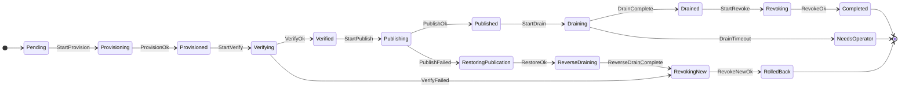

# KAWACH

**K**ey **A**nd **W**allet **A**udit & **C**redential **H**ardening
*(कवच — Sanskrit: armour, a protective shell.)*

Self-hostable secrets discovery, posture audit, and **graceful** credential rotation
for infrastructure teams.

> ### ⚠️ Status: pre-alpha — not usable yet
>
> **Phases 1–3 of 9 are complete.** What exists today is the security core and the
> rotation protocol: the types, the capability model, the state machine, and its proofs.
> There is **no CLI, no backend integration, and no working rotation yet** — those are
> phases 4–6. Nothing here should be pointed at production infrastructure.
>
> This README distinguishes throughout between what is **enforced in code** (●) and what
> is **designed but not built** (○). If you are evaluating KAWACH, the honest summary is
> in [DESIGN.md §12.4](DESIGN.md#124-not-yet-enforced).

---

## What & why, in 30 seconds

Every infrastructure estate has credentials nobody can account for: a password in a Helm
chart from 2021, an API key in a CI variable belonging to someone who left, a database
user that has not been rotated since it was created. The reason they are not rotated is
rarely ignorance — it is that **rotation risks an outage**, so it gets deferred forever.

KAWACH exists to make rotation boring enough to actually do:

| Pillar | Question it answers |
|---|---|
| **Discovery** | Where do credentials *actually* live — not where policy says they do? |
| **Audit** | For each one: how old, how exposed, how broad, how orphaned? Scored with a legible rationale, not an oracle number. |
| **Rotation** | Change it **without dropping a single connection**, with automatic compensation when a step fails. |

The third is the hard one, and it is what the architecture is built around. KAWACH treats
**availability as a security property**: the most likely harm a rotation tool causes is
not a leak, it is the outage it inflicts on itself.

## Safety statement

Read this before running anything, once there is anything to run.

- **Dry-run is the default for every mutating operation.** Not by a flag that could be
  ignored — by the type system. Mutating methods require a `CommitToken` that cannot be
  constructed outside an explicitly confirmed, audited `--apply` run.
- **KAWACH never stores a secret value.** It stores metadata and a keyed, non-invertible
  fingerprint. Not even a four-character prefix.
- **KAWACH never asks you to paste a master credential into it.** Its configuration
  format cannot express one — an inline token fails to deserialise.
- **An old credential is never revoked until the new one is proven to work** and until
  no consumer is observed still using the old one. If that cannot be proven, KAWACH
  stops and pages a human rather than guessing.
- **KAWACH is not on the availability path of your workloads.** Applications never fetch
  secrets through it.

What it does **not** protect against — host root, a compromised Vault control plane,
malicious plugin code, side channels — is stated plainly in
[DESIGN.md §3.4](DESIGN.md#34-explicitly-out-of-scope). Absence of discovery findings is
never evidence of a clean estate.

---

## Phases

### ✅ Completed

| # | Phase | What landed |
|:-:|---|---|
| **1** | **Design & threat model** | [DESIGN.md](DESIGN.md) — adversaries A1–A6, assets, trust boundaries, 8 security invariants each with its enforcement mechanism and *residual risk*, the rotation state machine, the audit-log construction, least-privilege policies, and a long limitations section. |
| **2** | **Security core** | [`kawach-core`](crates/kawach-core) — `SecretString`, keyed fingerprints, the three capability tokens, the scope model, scrubbing error types, and the `SecretBackend` / `RotationProvider` / `DiscoverySource` traits. |
| **3** | **Rotation protocol** | [`kawach-rotation`](crates/kawach-rotation) — the 16-state machine with compensation and reconciliation, the write-ahead journal with crash recovery, and an exhaustive model check of safety properties S1–S5. |

### ⬜ Planned

| # | Phase | Scope |
|:-:|---|---|
| **4** | **Tamper-evident audit log** | Hash chain over a canonical binary encoding, Ed25519 checkpoint signing, external anchoring to defeat tail truncation, and `kawach audit verify` reporting the first divergent sequence number. |
| **5** | **Rotation engine + Vault + PostgreSQL** ⭐ | The driver that runs the state machine against real systems, the Vault KV v2 backend, and the PostgreSQL A/B-role provider. **Ends with the zero-dropped-connections demo** — a load generator running through a live rotation with a drain observed via `pg_stat_activity`. |
| **6** | **Second backend & provider** | AWS Secrets Manager (staging labels map onto `stage`/`promote` natively) and a generic API-key provider, proving the plugin seams hold. |
| **7** | **Discovery & risk scoring** | Filesystem/git, `.env` and structured config, CI/CD variables, container env, backend enumeration; the detector chain; the explainable log-odds risk model with per-factor rationale. |
| **8** | **CLI, config, and `doctor`** | Declarative YAML with the scope allowlist, and the privilege self-audit that refuses to run as a Vault `root` token. |
| **9** | **CI & hardening** | GitHub Actions (build, clippy, test, `gitleaks`, `cargo-deny`), the redaction tripwire, `RLIMIT_CORE`/`PR_SET_DUMPABLE`/`mlockall` startup hardening, SECURITY.md, packaging. |

⭐ = the phase that makes the project credible; everything before it is groundwork.

---

## Architecture

```
                        ┌───────────────┐
                        │  kawach-cli   │  ○ phase 8
                        └───────┬───────┘
          ┌─────────────┬───────┴───────┬─────────────┐
          ▼             ▼               ▼             ▼
  ┌──────────────┐ ┌──────────┐ ┌────────────┐ ┌──────────┐
  │kawach-       │ │kawach-   │ │kawach-     │ │kawach-   │
  │rotation    ● │ │backends○ │ │discovery ○ │ │risk    ○ │
  │              │ │          │ │            │ │          │
  │ state machine│ │ vault    │ │ fs/git     │ │ log-odds │
  │ journal (WAL)│ │ aws sm   │ │ ci/cd vars │ │ scoring  │
  │ engine     ○ │ │ file/env │ │ container  │ │          │
  └───────┬──────┘ └────┬─────┘ └─────┬──────┘ └────┬─────┘
          │             │             │             │
          │      ┌──────┴─────────────┴─────────────┘
          ▼      ▼
  ┌─────────────────┐      ┌──────────────────┐
  │ kawach-providers│─────▶│ kawach-audit   ○ │  hash chain, witnesses
  │ postgres a/b  ○ │      └────────┬─────────┘
  │ generic api   ○ │               │
  └────────┬────────┘               │
           └───────────┬────────────┘
                       ▼
              ┌──────────────────┐
              │ kawach-core    ● │  SecretString, capability tokens,
              │                  │  Scope, the three traits
              └──────────────────┘

  ● implemented    ○ planned
```

Dependency arrows point downward only. `kawach-core` depends on no other KAWACH crate
and on a deliberately small set of third-party crates — it is the crate to review first
and most carefully.

### The rotation state machine

The signature feature. Full treatment in [DESIGN.md §6](DESIGN.md#6-the-rotation-state-machine).



Three design points that are not obvious:

1. **The `-ing` states are the write-ahead intent record.** The transition *into*
   `Publishing` is journalled and `fsync`ed before the backend call is made. After a
   crash, "outcome unknown" is therefore a *state* with a defined resolution — ask
   reality via `observe()`, then reconcile — rather than an ambiguity whose only safe
   response is to do nothing forever.
2. **Compensation is a mirror, not an undo.** Once the new credential is published, some
   consumers have adopted it. Naively revoking it would break exactly those consumers —
   the recovery path causing the outage. So rollback runs the forward path backwards
   *with a drain on the way*: restore publication → reverse-drain → revoke new.
3. **`NeedsOperator` is a feature.** A drain timeout leaves **both** credentials valid
   and pages a human, carrying a structured hint that names what is true of the world,
   what KAWACH refused to do, and what to do about it. There is no outage in the
   meantime.

### How zero-dropped-connections works for PostgreSQL

A PostgreSQL role has exactly one password, so single-role rotation breaks every
reconnect until the slowest consumer's cache expires. KAWACH uses the **A/B role
pattern** instead: two login roles sharing an owner role that holds the actual grants,
with one active at a time. The inactive role's password is rotated, verified on a fresh
connection, published, and only then is the old role drained — **observed** via
`pg_stat_activity.usename`, not slept on — before its password is discarded.

Waiting on evidence rather than a timer is what will let the phase-5 demo *prove* zero
dropped connections rather than assert it. Details and the failure modes that defeat it
(PgBouncer transaction pooling, missing `pg_read_all_stats`) are in
[DESIGN.md §6.6](DESIGN.md#66-graceful-rotation-for-postgresql-the-ab-role-pattern) and
[§12.1 L2](DESIGN.md#121-where-this-design-can-still-hurt-you).

---

## Backends & providers

Everything is a trait impl; adding one requires no core changes.

### Secret backends — `SecretBackend`

| Backend | Status | Phase | Notes |
|---|:--:|:--:|---|
| HashiCorp Vault (KV v2) | ○ | 5 | AppRole / token auth from a file or env var *name* |
| AWS Secrets Manager | ○ | 6 | `AWSPENDING`/`AWSCURRENT` map natively onto `stage`/`promote` |
| File / env (discovery only) | ○ | 7 | Read-only source, never a rotation target |

### Rotation providers — `RotationProvider`

| Provider | Status | Phase | Graceful? |
|---|:--:|:--:|---|
| PostgreSQL (A/B roles) | ○ | 5 | Yes — observed drain via `pg_stat_activity` |
| Generic API key | ○ | 6 | Depends on vendor; time-based drain, labelled lower assurance |

### Discovery sources — `DiscoverySource`

| Source | Status | Phase |
|---|:--:|:--:|
| Filesystem / git worktree | ○ | 7 |
| `.env` and structured config | ○ | 7 |
| GitHub Actions / GitLab CI | ○ | 7 |
| Container / pod environment | ○ | 7 |
| Backend enumeration | ○ | 7 |

---

## What is enforced today

These are live in code and covered by tests — not aspirations. Full detail with residual
risk per invariant in [DESIGN.md §4](DESIGN.md#4-security-invariants-and-how-each-is-enforced).

| Invariant | Enforcement |
|---|---|
| **I1** No plaintext egress | `SecretString` implements neither `Serialize` nor `Display` — serialising or interpolating a secret is a **compile error**, asserted at compile time by `tests/type_level_guarantees.rs`. Plaintext is reachable only via a closure-scoped `expose()`, so `rg 'expose'` enumerates the whole attack surface. |
| **I2** Zeroization | `Zeroizing<Vec<u8>>` with volatile overwrite on drop. Residual risk from compiler-inserted copies is documented, not hand-waved. |
| **I3** Metadata only | Findings carry a 128-bit truncated HMAC-SHA-256 under an install-scoped key. Zero plaintext characters — no prefixes. |
| **I7** Dry-run default | `CommitToken` has a private constructor reachable only from `ExecutionMode::Apply`. A dry run *cannot* mutate; a plugin gains nothing by ignoring a flag it does not receive. |
| **I8** Availability | Machine-checked: **S2** asserts that at every reachable state, at least one credential is both live and published. |
| Scope | Backend methods take `ScopedRef`, obtainable only from `Scope::authorize`. Out-of-scope access is unrepresentable, not merely checked. |
| Audited reads | `read()` requires a `ReadWitness`, issued only after a durable audit record. Dropping one without completing it records the abandonment — even a panic mid-read leaves evidence. |

### The model checker

`crates/kawach-rotation/tests/model_check.rs` explores the **entire** reachable
state × world space — the machine is finite and small, so it is not sampled — and asserts
five safety properties at every node:

| | Property |
|---|---|
| **S1** | A rotation completes only if the new credential was verified. |
| **S2** | Consumers always have at least one credential that is live *and* published. |
| **S3** | Terminal states leave no orphaned live credential. |
| **S4** | Every state is reachable, and every state can still reach a terminal state. |
| **S5** | An unverified credential is never published. |

Failure outcomes are modelled **nondeterministically** — `ProvisionFailed` explores both
"nothing was created" and "a credential was created and then the call failed", because a
failure never tells you whether the effect landed. And a **meta-test points the same
checker at a deliberately broken machine** (one that revokes on verification failure) and
asserts it fails S1 *and* S2. A model checker that cannot fail is not evidence of
anything.

---

## Building

Requires a recent stable Rust toolchain (1.75+).

```sh
git clone https://github.com/amibhai/KAWACH
cd KAWACH

cargo test --workspace              # unit, integration, and the model check
cargo clippy --all-targets          # lints; the workspace denies unsafe_code
```

There is deliberately **no quickstart yet** — there is nothing to run. The Vault dev-server
quickstart and the Docker-based zero-downtime rotation demo arrive with **phase 5**.

If you want to read the code, the order that will make sense is:

1. [DESIGN.md](DESIGN.md) §3 (threat model) and §4 (invariants) — the *why*.
2. [`crates/kawach-core/src/secret.rs`](crates/kawach-core/src/secret.rs) and
   [`capability.rs`](crates/kawach-core/src/capability.rs) — the types the guarantees rest on.
3. [`crates/kawach-rotation/src/state.rs`](crates/kawach-rotation/src/state.rs) — the protocol.
4. [`crates/kawach-rotation/tests/model_check.rs`](crates/kawach-rotation/tests/model_check.rs) — the proofs.

---

## Reporting a vulnerability

Please **do not** open a public issue for a security report.

Use GitHub's [private vulnerability reporting](https://github.com/amibhai/KAWACH/security/advisories/new)
on this repository. A dedicated `SECURITY.md` with a disclosure policy and response-time
commitments lands in phase 9.

Given the pre-alpha status, the most useful reports right now are **design** flaws:
an invariant in DESIGN.md §4 whose stated enforcement does not actually hold, or a
reachable state in the rotation machine that violates S1–S5.

## Contributing

The state machine and `kawach-core` are held to a higher bar than ordinary code, because
a mistake in either is an outage or a leak. In particular: no new dependency in
`kawach-core` without a justification in the
[dependency budget](DESIGN.md#13-dependency-budget), and no new state-machine transition
without the model checker still passing.

Credential-shaped test fixtures must be assembled at run time rather than written as
literals — a vendor-prefixed literal in the source is a real credential as far as any
secret scanner is concerned, and this repository does not allowlist itself.

## License

[GPL-3.0-or-later](LICENSE).
